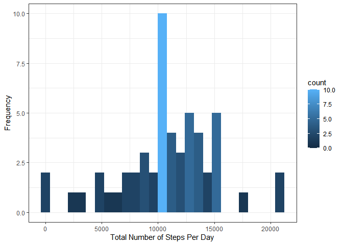
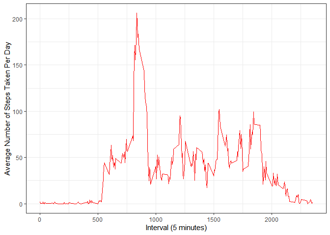
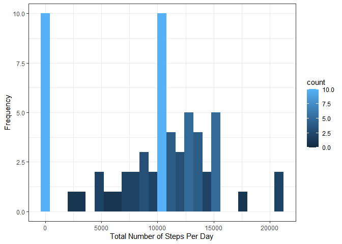
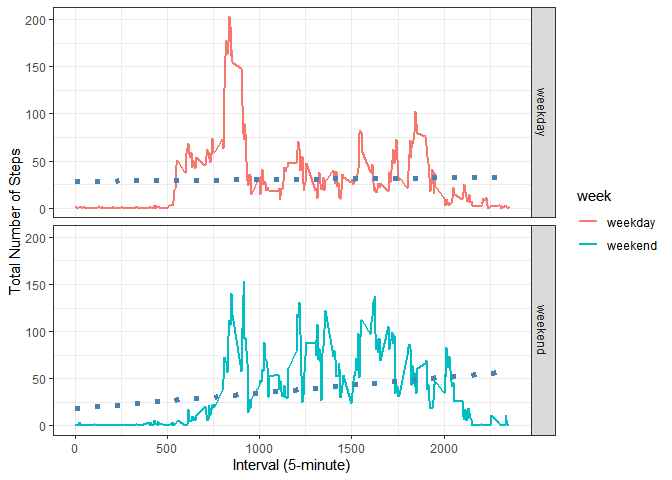

Coursera Reproducible Research Week 2 Course Project
=========================================================================

This submission analyzes the data from a personal activity monitoring device collected during the months of October and November 2012. The data was retrieved from https://d396qusza40orc.cloudfront.net/repdata%2Fdata%2Factivity.zip. The following describes the measurements and analyses done, and their corresponding outputs. 

<!-- html table generated in R 3.6.3 by xtable 1.8-4 package -->
<!-- Sun May 17 15:17:17 2020 -->
<table border=1>
<tr> <th>  </th> <th> Measurements/Analyses </th> <th> Output </th>  </tr>
  <tr> <td align="right"> A </td> <td>  total number of steps taken each day  </td> <td>  histogram  </td> </tr>
  <tr> <td align="right"> B </td> <td>  Mean and median number of steps taken each day  </td> <td>  summary table  </td> </tr>
  <tr> <td align="right"> C </td> <td>  average number of steps taken  </td> <td>  time series plot  </td> </tr>
  <tr> <td align="right"> D </td> <td>  5-minute interval that, on average, contains the maximum number of steps  </td> <td>  summary  </td> </tr>
  <tr> <td align="right"> E </td> <td>  total number of steps taken each day after missing values are imputed  </td> <td>  histogram  </td> </tr>
  <tr> <td align="right"> F </td> <td>  the average number of steps taken per 5-minute interval across weekdays and weekends  </td> <td>  panel plot  </td> </tr>
   </table>

### Analysis and Results

First, read the csv data, and check some of its properties.


```r
read.csv("activity.csv") ->dataset
str(dataset)
```

```
## 'data.frame':	17568 obs. of  3 variables:
##  $ steps   : int  NA NA NA NA NA NA NA NA NA NA ...
##  $ date    : Factor w/ 61 levels "2012-10-01","2012-10-02",..: 1 1 1 1 1 1 1 1 1 1 ...
##  $ interval: int  0 5 10 15 20 25 30 35 40 45 ...
```

#### A. Total Number of Steps Taken Each Day

```r
as.Date(dataset$date,  "%Y-%m-%d") -> dataset$date
```

```r
suppressPackageStartupMessages(library(ggplot2, quietly = TRUE))
suppressPackageStartupMessages(library(dplyr, quietly = TRUE))

group_by(dataset, date) %>% summarize(steps= sum(steps)) -> totalsum

suppressWarnings(figure1<- (ggplot(totalsum, aes(x=steps)) + geom_histogram(aes(y=..count.., fill=..count..), binwidth = 800)+ theme_bw(base_family="Times") + labs(y= "Frequency", x= "Total Number of Steps Per Day")))

suppressWarnings(print(figure1))
```

<!-- -->

#### B. Mean and Median Number of Total Number of Steps Taken Each Day

```r
with(dataset, tapply(steps, date, sum)) -> mm
   summary(mm) -> mmb
      print(paste("The mean is", mmb[4], "and the median is", mmb[3], sep=" "), quote = F)
```

```
## [1] The mean is 10766.1886792453 and the median is 10765
```

#### C. Average Number of Steps Taken Per Day

```r
suppressWarnings(figure2 <- (ggplot(dataset, aes(interval, steps)) + geom_line(stat = "summary", fun= "mean", na.rm = TRUE, color="red") + theme_bw(base_family = "Times") + labs(y= "Average Number of Steps Taken Per Day", x= "Interval (5 minutes)")))

suppressWarnings(print(figure2))
```

<!-- -->

#### D. 5-minute Interval that, on Average, Contains the Maximum Number of steps

```r
with(dataset, tapply(steps, interval, mean, na.rm=T)) -> d
   (max(d) == d) -> true
      names(d[true]) -> f
         paste(f, "minute-interval", "with", d[true], "steps", sep = " ") -> f 

print(noquote(f))
```

```
## [1] 835 minute-interval with 206.169811320755 steps
```

#### E. Total Number of Steps Taken Each Day After Missing Values Are Imputed

```r
sum(is.na(dataset)) -> e
   paste("Number of NAs is", e, sep = " ") -> e

print(noquote(e))
```

```
## [1] Number of NAs is 2304
```
Imputation of Missing Values was done using the code chunk below. Missing values (NA) were replaced by the average of all median values of total steps taken computed by date. This was done, because there are dates wherein all of their values are missing; thus, to more or less preserve uniformity and distribution in totality, the said imputation method was done.

```r
suppressPackageStartupMessages(library(dplyr, quietly = TRUE))
   with(dataset, tapply(steps, date, median)) -> med

e2 <- tibble(x=1)

for (i in 1:length(dataset$steps)) {if (is.na(dataset$steps[i]) == TRUE) {add_row(e2,x=    mean(med, na.rm = T))-> e2} else {add_row(e2,x= dataset$steps[i]) -> e2}; e2 -> e3}; e3 -> e3;
e3[2:nrow(e3),] -> e3

   cbind(dataset, e3) -> newdata
      group_by(newdata, date) %>% summarize(x= sum(steps, na.rm = TRUE)) -> totalsum2

suppressWarnings(figure6<- (ggplot(totalsum2, aes(x= x)) + geom_histogram(aes(y=..count.., fill=..count..), binwidth = 800)+ theme_bw(base_family="Times") + labs(y= "Frequency", x= "Total Number of Steps Per Day")))

suppressWarnings(print(figure6))
```

<!-- -->

```r
with(newdata, tapply(x, date, sum)) -> mm2
   summary(mm2)
```

```
##    Min. 1st Qu.  Median    Mean 3rd Qu.    Max. 
##       0    6778   10395    9354   12811   21194
```
##### Comparison of Summary of Non-Imputed Dataset and Imputed Dataset

```r
summary(mm) -> a; as.vector(a) -> a; summary (mm2) -> b; names(b) -> name; as.vector(b)-> b;
   suppressWarnings(rbind(a, b) -> ab); as.data.frame(ab) -> ab; colnames(ab) = name; rownames(ab) = c("Non-Imputed Data", "Imputed Data");

print(ab)
```

```
##                  Min. 1st Qu. Median     Mean 3rd Qu.  Max. NA
## Non-Imputed Data   41    8841  10765 10766.19   13294 21194  8
## Imputed Data        0    6778  10395  9354.23   12811 21194  0
```

#### F. The Average Number of Steps Taken per 5-minute Interval Across Weekdays and Weekends

```r
neww <- tibble(x=0) 
for (i in 1:length(newdata$date)) 
{if (weekdays(newdata$date[i])== "Saturday"){add_row(neww, x= 1) -> neww} 
   else if (weekdays(newdata$date[i]) == "Sunday") {add_row(neww, x= 1)-> neww}
   else {add_row(neww, x= 2)-> neww}; neww -> neww3}; neww3 -> neww3; neww3[2:nrow(neww3),] -> 
   value1; as.data.frame(value1) -> newdata$value

mutate(newdata, week= ifelse(value == 2, "weekday", "weekend")) -> f
   f <- transform(f, week= factor(week))

suppressWarnings(figure7<- (ggplot(f, aes(interval, x)) + geom_line(size=1, stat = "summary", fun="mean", na.rm = TRUE, aes(color=week))+ theme_bw(base_family="Times") + labs(y= "Total Number of Steps", x= ("Interval (5-minute)")) + facet_grid(week~.) + suppressMessages(geom_smooth(linetype= 3, size= 2, method="lm", se=FALSE, col="steelblue"))))

suppressWarnings(print(figure7))
```

```
## `geom_smooth()` using formula 'y ~ x'
```

<!-- -->

